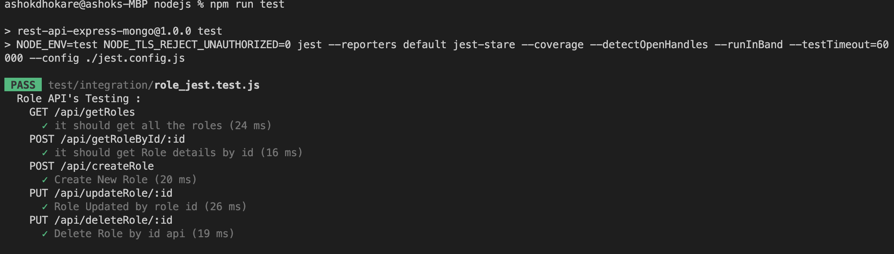

# API Testing Framework With Jest And SuperTest

### Focus on API testing
Before starting off, below listed are the reasons why API testing should be encouraged:
* Identifies bugs before it goes to UI
* Effective testing at a lower level over high-level broad-stack testing
* Reduces future efforts to fix defects
* Time-saving
<br/>

Well, QA practices are becoming more automation-centric with evolving requirements, but identifying the appropriate approach is the primary and the most essential step. This implies choosing a framework or a tool to develop a test setup which should be:

* Scalable 
* Modular
* Maintainable
* Able to provide maximum test coverage
* Extensible
* Able to generate test reports
* Easy to integrate with source control tool and CI pipeline

To attain the goal, why not develop your own asset rather than relying on the ready-made tools like [Postman](https://www.postman.com/), [JMeter](https://jmeter.apache.org/), or any? Let’s have a look at why you should choose ‘writing your own code’ over depending on the API testing tools available in the market:


1. Customizable
2. Saves you from the trap of limitations of a ready-made tool
3. Freedom to add configurations and libraries as required and not really depend on the specific supported plugins of the tool
4. No limit on the usage and no question of cost

There are **three** most used packages in api testing are. 
 
 **[Chai](https://www.npmjs.com/package/chai) vs [jest](https://www.npmjs.com/package/jest) vs [mocha](https://www.npmjs.com/package/mocha)**
 
<br/>


We can overcome such annoyance and meet our purpose using a self-built **[Jest](https://www.npmjs.com/package/jest) framework using [SuperTest](https://www.npmjs.com/package/superset)**.

### Why Jest?
Jest is pretty impressive. 
* High performance
* Easy and minimal setup
* Provides in-built assertion library and mocking support
* Several in-built testing features without any additional configuration
* Snapshot testing
* Brilliant test coverage
* Allows interactive watch mode ( jest --watch or jest --watchAll )

Hold on. Before moving forward, let’s quickly visit **[Jest configurations](https://jest-bot.github.io/jest/docs/configuration.html), [Jest CLI commands](https://jestjs.io/docs/en/cli.html), [Jest Globals](https://jestjs.io/docs/en/api) and [Javascript async/await](https://javascript.info/async-await)** for better understanding of the coming content.

We consider as you already created the project (npm init).

First create a test/unit  folder in your project directory.

As per below screenshot.


 
#### Setup  Packages 
* [Jest](https://jestjs.io/)
* [jest-stare](https://www.npmjs.com/package/jest-stare)
* [Jest-serial-runner](https://www.npmjs.com/package/jest-serial-runner)

We install these packages under  **devDependencies. You can see it in the package.json** file.

```
npm install jest jest-stare jest-serial-runner --save-dev
```

Tags to the scripts block in our package.json

```javascript
"scripts": {
    "start": "nodemon --ignore 'swagger.js'  index.js",
    "start-gendoc": "node swagger.js",
    "test": "NODE_ENV=test NODE_TLS_REJECT_UNAUTHORIZED=0 jest --reporters default jest-stare --coverage --detectOpenHandles --runInBand --testTimeout=60000 --config ./jest.config.js",
    "test:watch": "jest --verbose --watchAll",
 },
 ```
 
“test” and “test:watch” should be added.

**npm run test** command will invoke the test parameter with the following:

* NODE_TLS_REJECT_UNAUTHORIZED=0: ignores the SSL certificate
* jest: runs the framework with the configurations defined under Jest block
* --reporters: default jest-stare 
* --coverage: invokes test coverage
* --detectOpenHandles: for debugging
* --runInBand: serial execution of Jest tests
* --forceExit: to shut down cleanly
* --testTimeout = 60000 (custom timeout, default is 5000 milliseconds)
* --config ./jest.config.js : We use jest config file

 

### Jest configurations:
#### Note: This is customizable as per requirements.
Create a **jest.config.js** file in your project directory. We are using the jest.config.js file in the test script in package.json.  

```javascript
module.exports = {
    testEnvironment: 'node',
    moduleFileExtensions: [
      'ts',
      'tsx',
      'js',
      'jsx',
      'json',
      'node'
    ],
    // setupFiles: ['<rootDir>/test-teardown-globals.js'],
    verbose: true,
    coverageDirectory: "/Users/ashokdhokare/Documents/nodejs/test/",
    coverageReporters: ["html","text"],
    coverageThreshold: {
    global: {
            "branches": 100,
            "functions": 100,
            "lines": 100,
            "statements": 100
          }
        }
};
 
```
### Testing endpoints with SuperTest
[SuperTest](https://www.npmjs.com/package/supertest) is a node library, [superagent](https://www.npmjs.com/package/superagent) driven, to extensively test Restful web services. It hits the HTTP server to send requests (GET, POST, PATCH, PUT, DELETE ) and fetch responses.
 
Install SuperTest and save it as a dependency.

```bash
npm install supertest --save-dev
```
See your package.json  

``` javascript
"devDependencies": {
    "jest": "^29.3.1",
    "jest-serial-runner": "^1.2.1",
    "jest-stare": "^2.4.1",
    "supertest": "^6.3.3"
  }
```
Now we are ready to create our Jest tests with some defined conventions:

* describe block - assembles multiple tests or its
* test block - (an alias usually used is ‘it’) holds single test 
* expect() -  performs assertions 

It recognizes the test files in test/ folder
* with .test.js extension
* with .spec.js extension

We are testing on POST, GET, PUT and DELETE request api.

Let’s write **tests.test.js** file.  [Complete source code ]()
 
``` javascript
process.env.NODE_ENV = "test";
const supertest = require("supertest");
const { response } = require("../../index");
const app = require("../../index");
  const mongoose = require('mongoose');
// read data for global
const inputData = require("./inputdata");
const { deleteOne } = require("../../model/role");
const { disconnect } = require("mongoose");
 
let token;
describe("Role API's Testing : ", () => {
  beforeAll(async () => {
    await supertest(app)
      .post("/api/login")
      .send(inputData.defaultUser)
      .then((response) => {
        expect(response.statusCode).toBe(200);
        token = response._body.data.token;
       
      });
      
  });
 
  afterAll(async () => {
    await mongoose.disconnect(); 
  });
 
  describe("GET /api/getRoles", () => {
    test("it should get all the roles", async () => {
      await supertest(app)
        .get("/api/getRoles")
        .set({ Authorization: `Bearer ${token}` })
        .then((response) => {
          expect(response.statusCode).toBe(200);
         
        });
      
    });
  });
 
  describe("POST /api/getRoleById/:id", () => {
    test("it should get Role details by id", async () => {
      await supertest(app)
        .post("/api/getRoleById/" + inputData.id)
        .set({ Authorization: `Bearer ${token}` })
        .then((response) => {
          expect(response.statusCode).toBe(200);
         
        });
    });
  });
 
  describe("POST /api/createRole", () => {
    test("Create New Role", async () => {
      await supertest(app)
        .post("/api/createRole")
        .send(inputData.roleDetails)
        .set({ Authorization: `Bearer ${token}` })
        .then((response) => {
          if (response._body["message"] === "Role already exists") {
            expect(response.statusCode).toBe(401);
            expect(response._body["message"]).toEqual("Role already exists");
           
          } else {
            expect(response.statusCode).toBe(200);
            expect(response._body["message"]).toEqual(
              "Role created successfully"
            );
           
          }
        });
    });
  });
 
  describe("PUT /api/updateRole/:id", () => {
    test("Role Updated by role id", async () => {
      await supertest(app)
        .put("/api/updateRole/" + inputData.id)
        .send(inputData.updateRole)
        .set({ Authorization: `Bearer ${token}` })
        .then((response) => {
          expect(response.statusCode).toBe(200);
          expect(response._body["message"]).toEqual("Role update successfully");
          
        });
    });
  });
 
  describe("PUT /api/deleteRole/:id ", () => {
    test("Delete Role by id api", async () => {
      await supertest(app)
        .put("/api/deleteRole/" + inputData.deleteId)
        .set({ Authorization: `Bearer ${token}` })
        .then((response) => {
            expect(response.statusCode).toBe(200);
            expect(response._body["message"]).toEqual("Role delete successfully");
           
        });
    });
  });
});
 
 
```
Save the file in the test/unit folder.
And we are done with setting up a decent framework and just a command away!

```bash
npm test 
```
Once complete, the test results will be immediately visible on the terminal.




 
**Test results HTML report is also generated as index.html under jest-stare/**


 
And test coverage details are created under 
**coverageDirectory: "/Users/xxxx/Documents/nodejs/test/",**
 in the workspace. 
**coverageDirectory** path you can add in **jest.config.js** file.


 

All done!
 
I hope you had a good read. Kindly spread the word. Happy coding!
 
 


